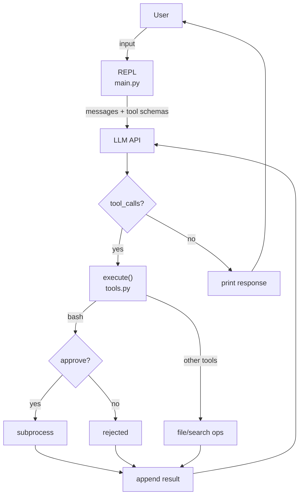

# kodex

An educational coding CLI agent, similar to Claude Code or Gemini CLI. Built in Python using the OpenAI-compatible API with Gemini models.

Designed to be read and understood in ~10 minutes.

## Quick Start

```bash
# add your API key(s)
mkdir -p ~/.kodex
echo '{"google": "your-key"}' > ~/.kodex/keys.json

# run
uv run kodex
```

## Architecture



### How the Agentic Loop Works

1. User types a message
2. Message is sent to the Gemini API with tool definitions
3. If the model returns **text** → print it, done
4. If the model returns **tool calls** → execute each tool, append results, go to step 2
5. Repeat until the model responds with text only

### Command Approval

When the model calls `bash`, the user is prompted:

```
  Command: git status
  Allow? (y)es once / (a)lways / (n)o:
```

- **y** — approve this single execution
- **a** — approve this command name (`git`) for the entire session
- **n** — reject, return error to model

All other tools (`read_file`, `write_file`, `edit`, `glob`, `grep`, `list_files`) execute without approval.

## Project Structure

```
kodex/
├── README.md            # this file
├── pyproject.toml       # uv/pip project config
└── kodex/
    ├── __init__.py
    ├── __main__.py      # python -m kodex entry point
    ├── main.py          # REPL, client, agentic loop
    ├── tools.py         # tool execution logic
    ├── models.json      # endpoint/model configuration
    ├── prompt.txt       # system prompt (supports {cwd} placeholder)
    └── tools.json       # tool schemas sent to the API
```

## User Overrides (`~/.kodex/`)

Drop any of these files in `~/.kodex/` to override defaults without modifying the source:

| File          | Effect                                      |
|---------------|---------------------------------------------|
| `models.json` | Merged into default config (top-level keys) |
| `prompt.txt`  | Replaces the system prompt entirely         |
| `tools.json`  | Replaces the tool schemas entirely          |

## Slash Commands

| Command     | Description              |
|-------------|--------------------------|
| `/model`    | Switch between pro/flash |
| `/endpoint` | Switch endpoint          |
| `/help`     | Show available commands  |
| `/exit`     | Quit                     |

## Configuration

| Setting   | Default                        |
|-----------|--------------------------------|
| Model     | `gemini-3.1-flash-lite-preview` |
| Endpoint  | Google (OpenAI-compatible)     |

### API Keys

Create `~/.kodex/keys.json` with per-endpoint keys:

```json
{
  "google": "your-gemini-key",
  "openai": "your-openai-key",
  "openrouter": "your-openrouter-key"
}
```

Falls back to `OPENAI_API_KEY` env var if `keys.json` is missing. Keys are matched by endpoint name; unmatched endpoints use the first available key.

### Available Endpoints

| Endpoint    | Models                          |
|-------------|---------------------------------|
| google      | `gemini-3.1-pro-preview`, `gemini-3.1-flash-lite-preview` |
| openrouter  | `arcee-ai/trinity-large-preview:free`, `nvidia/nemotron-3-nano-30b-a3b:free` |
